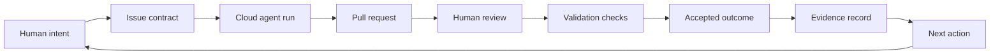
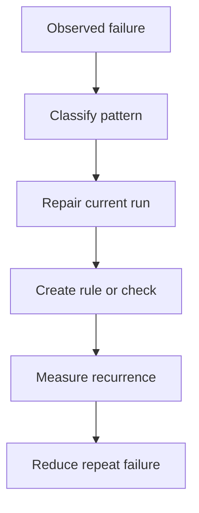
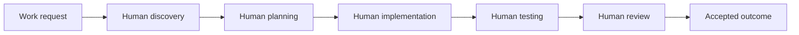
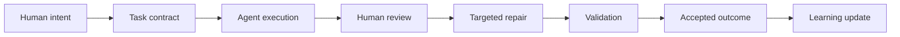

# Operating Evidence for Agentic Delivery

## A Public Proof Model for AI-Agent Software Delivery

### Executive Summary

Agentic software delivery should not be evaluated by anecdotes, generated code volume, or model enthusiasm. It should be evaluated by operating evidence.

The evidence is the loop itself:

- issues created;
- pull requests opened;
- validation checks run;
- repairs required;
- failures retired;
- evidence records updated;
- accepted outcomes merged;
- next actions selected.

This paper presents a public-safe proof model for agentic delivery. It uses anonymized metrics from one live modernization operating loop to show how a human-plus-agent model can be measured against traditional software delivery.

The headline from the observed high-throughput loop:

- 35 dispatch records;
- 30 completed outcomes;
- 5 failed or voided attempts;
- 30 merged pull requests in the measured set;
- 9 delivered implementation slices;
- 10 completed orchestration runs;
- 4 census runs;
- 1 target-system buildout run;
- recent supervised loop median PR cycle time: **28.9 minutes**;
- recent supervised loop average PR cycle time: **27.6 minutes**;
- recent supervised loop range: **14.5 to 48.4 minutes**.

These numbers are not a universal benchmark. They are a proof shape: a way to show that agentic delivery can be inspected, measured, corrected, and improved.

---

## 1. What Counts as Proof?

For AI-agent delivery, proof is not a single demo. Proof is a traceable operating record.

A credible proof model should include:

- work intake records;
- agent dispatch records;
- pull request history;
- validation status;
- review and repair history;
- failure classification;
- accepted outcomes;
- post-merge state updates;
- next-action decisions.

This matters because agent output is fluent by default. Fluency is not proof. Accepted, validated, reviewable output is proof.

---

## 2. The Observed Operating Loop

The measured loop used a human-plus-agent workflow over a software modernization repository. The work included discovery, orchestration, implementation, evaluation, documentation refresh, and target-system buildout.

The loop can be represented as:



The key point is that the agent is not the whole system. The system is the loop.

---

## 3. Observed Metrics

The following table summarizes the observed operating record.

| Metric | Observed value |
|---|---:|
| Dispatch records | 35 |
| Completed dispatch outcomes | 30 |
| Failed or voided attempts | 5 |
| Merged pull requests in measured set | 30 |
| Implementation slices delivered | 9 |
| Orchestration runs completed | 10 |
| Census runs completed | 4 |
| Target-system buildout runs completed | 1 |
| Recent supervised loop PRs measured | 9 |
| Recent supervised loop median PR cycle time | 28.9 minutes |
| Recent supervised loop average PR cycle time | 27.6 minutes |
| Recent supervised loop fastest PR cycle time | 14.5 minutes |
| Recent supervised loop slowest PR cycle time | 48.4 minutes |

Cycle time is measured from pull request creation to merge. Long-running outliers from earlier asynchronous periods are excluded from the recent supervised-loop statistic and should be reported separately, not hidden.

---

## 4. Why Median and Subset Matter

All-run averages can be misleading. In the observed history, one long-running branch spanned many days and distorted the average. The median was more representative for the full merged PR set.

For the full measured set of merged pull requests:

- count: 30;
- median: 38.9 minutes;
- minimum: 8.6 minutes;
- maximum: long-running asynchronous outlier.

For the recent high-supervision loop:

- count: 9;
- average: 27.6 minutes;
- median: 28.9 minutes;
- range: 14.5 to 48.4 minutes.

This is the honest reporting pattern: include the overall distribution, call out outliers, and then identify the operational mode being evaluated.

---

## 5. Failure Patterns Are Part of the Proof

The loop did not work perfectly. That is important.

Observed failure patterns included:

- invalid early dispatch attempts;
- missing or empty issue bodies;
- branch or commit failures;
- stale evidence assumptions;
- pull request body drift;
- evidence hash drift;
- active-run file conflicts;
- wrapper/API dispatch mismatch;
- false-positive candidate selection.

These failures are not embarrassing footnotes. They are the learning material. A mature agentic system improves because failures become checks, templates, stop conditions, and operating rules.



---

## 6. Traditional Delivery Versus Human-Plus-Agent Delivery

Traditional software delivery and agentic delivery have different cost structures.

### 6.1 Traditional Delivery Pattern



Traditional delivery cost is dominated by human discovery, implementation, testing, and review time.

### 6.2 Human-Plus-Agent Delivery Pattern



Human-plus-agent delivery shifts effort from direct production of every artifact to intent setting, task design, review, repair, validation, and learning.

---

## 7. Comparative Cost Model

The model below is intentionally simple. It can be adapted to any organization.

### 7.1 Variables

| Symbol | Meaning |
|---|---|
| `R` | Loaded human cost per hour |
| `T_d` | Traditional discovery hours |
| `T_b` | Traditional build hours |
| `T_t` | Traditional test and validation hours |
| `T_r` | Traditional review and rework hours |
| `A_i` | Human intent and task-contract hours |
| `A_v` | Human review and validation hours |
| `A_p` | Human repair or prompt-adjustment hours |
| `M` | Model and tool cost for the agent run |
| `Q` | Quality adjustment for defects or rework |

### 7.2 Traditional Cost

```text
Traditional cost = R * (T_d + T_b + T_t + T_r) + Q
```

### 7.3 Human-Plus-Agent Cost

```text
Human plus agent cost = R * (A_i + A_v + A_p) + M + Q
```

### 7.4 Break-Even Condition

```text
Human plus agent wins when:

R * (T_d + T_b + T_t + T_r) > R * (A_i + A_v + A_p) + M
```

In plain English: the agentic loop is economically useful when the human time removed from discovery, drafting, implementation, and evidence collection is greater than the added cost of model usage, review, repair, and governance.

---

## 8. Illustrative Cost Scenario

This is an illustrative model, not a universal benchmark.

Assume:

- loaded human cost: `R = 150` per hour;
- traditional small modernization slice: `12` human hours;
- human-plus-agent path: `3` human hours;
- model and tool cost: `75`;
- quality adjustment equal for simplicity.

| Delivery model | Human hours | Human cost | Model/tool cost | Total |
|---|---:|---:|---:|---:|
| Traditional | 12 | 1800 | 0 | 1800 |
| Human plus agent | 3 | 450 | 75 | 525 |

Illustrative reduction:

```text
(1800 - 525) / 1800 = 70.8 percent
```

This example is deliberately conservative in structure and should be recalculated with local rates, task types, and model costs. The key point is not the exact number. The key point is the measurement method.

---

## 9. Where the Cost Model Can Fail

Human-plus-agent delivery is not automatically cheaper.

It can lose when:

- the task is poorly scoped;
- the agent creates a large diff;
- review takes longer than manual work;
- validation fails repeatedly;
- context costs are uncontrolled;
- the wrong model is used;
- evidence is missing;
- rework is high.

This is why cost per accepted outcome is a stronger metric than token spend alone.

---

## 10. Proof Spine

A public-safe proof spine can expose metrics and patterns without exposing sensitive code or customer details.

Recommended public proof fields:

| Field | Public-safe example |
|---|---|
| Dispatch count | 35 |
| Accepted outcomes | 30 |
| Failure count | 5 |
| Recent supervised median cycle | 28.9 minutes |
| Recent supervised average cycle | 27.6 minutes |
| Fastest recent cycle | 14.5 minutes |
| Slowest recent cycle | 48.4 minutes |
| Implementation slices | 9 |
| Orchestration runs | 10 |
| Notable learning | dispatch ordering, evidence validation, contract finalization |

Avoid publishing:

- customer names;
- proprietary source paths;
- sensitive findings;
- internal prompts;
- secrets or configuration;
- unreviewed model outputs.

---

## 11. What This Proves

The observed loop does not prove that every agentic delivery workflow will average 30 minutes. It proves something more useful:

1. Agentic delivery can be instrumented.
2. Failures can be classified and converted into operating rules.
3. Human review remains central.
4. Evidence records make agent output auditable.
5. The system can improve over repeated runs.
6. Cost can be modeled at the accepted-outcome level.

This is the shift from AI as a tool to AI as an engineered delivery system.

---

## Conclusion

The proof of agentic delivery is not a single impressive output. It is a repeatable operating record.

Issues, pull requests, validation checks, repairs, failures, and accepted outcomes create a measurable loop. When that loop is governed, reviewed, and improved, AI agents become more than assistants. They become part of the software delivery system.
